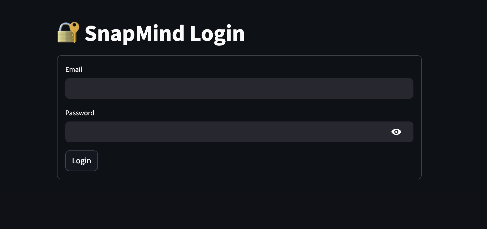

# SnapMind

SnapMind is a mobile-first app that converts screenshots into usable knowledge.

SnapMind is a mobile-first app that converts screenshots into usable knowledge.

## Features

- Upload screenshots
- Extract text (OCR)
- Clean text
- Edit before saving
- Download notes
- Clear interface

## Run locally

pip install -r requirements.txt  
streamlit run app.py